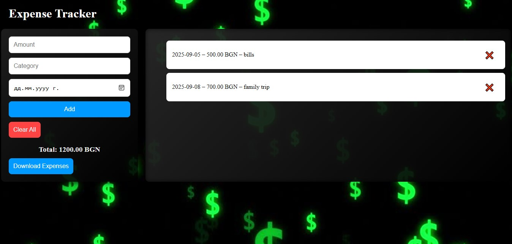

# Expense Tracker

This is a simple Expense Tracker web app built with HTML, CSS, and JavaScript. 
It allows users to add expenses, view a total balance, delete individual entries, clear all data, and download a full PDF report of their expenses.

## Design

The app features a clean and modern dark-themed UI with a money-themed background image. 
Stylish panels, responsive layout, and interactive buttons create a smooth and user-friendly experience.

## Features:

1. Add a new expense (amount, category, and date)
2. Delete individual expenses
3. Clear all expenses at once
4. View total spending in BGN
5. Data is saved using LocalStorage
6. Download a PDF report of your expenses
7. Fully responsive layout (mobile-friendly)

# Technologies Used:

HTML, CSS, JavaScript (DOM manipulation, localStorage, events)
jsPDF and jsPDF AutoTable (for generating PDF reports)
Background image – money.jpg

This project is part of my learning journey in web development. 
I wanted to create something useful and practical while practicing JavaScript, data handling, and basic UI/UX principles. 

Here is an example:

# NOTICE: 
In the current screenshot, the date is displayed in Bulgarian because of my browser settings.

# Check out the live version of the app here:  

<a href="https://anina1999.github.io/Expense-Tracker/" target="_blank">$$$ Expense Tracker – Live $$$</a>

# LICENSE

This project is open for educational use and personal learning.

# If you like this project, feel free to ⭐ star the repo and share your feedback!
